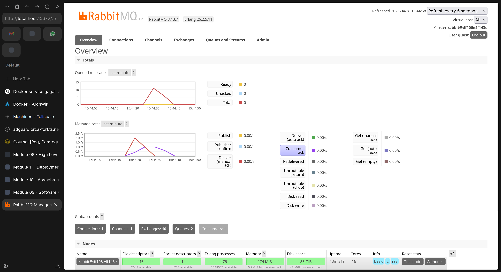
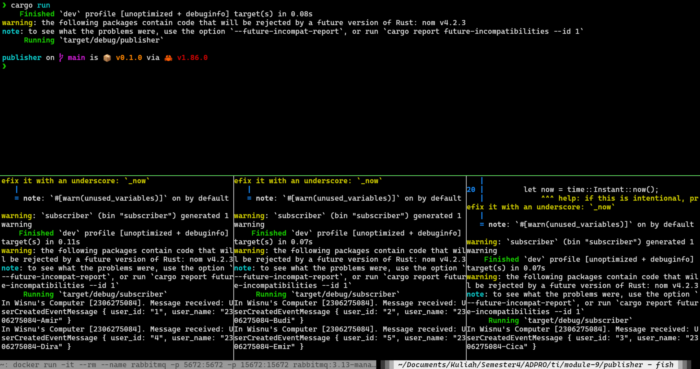
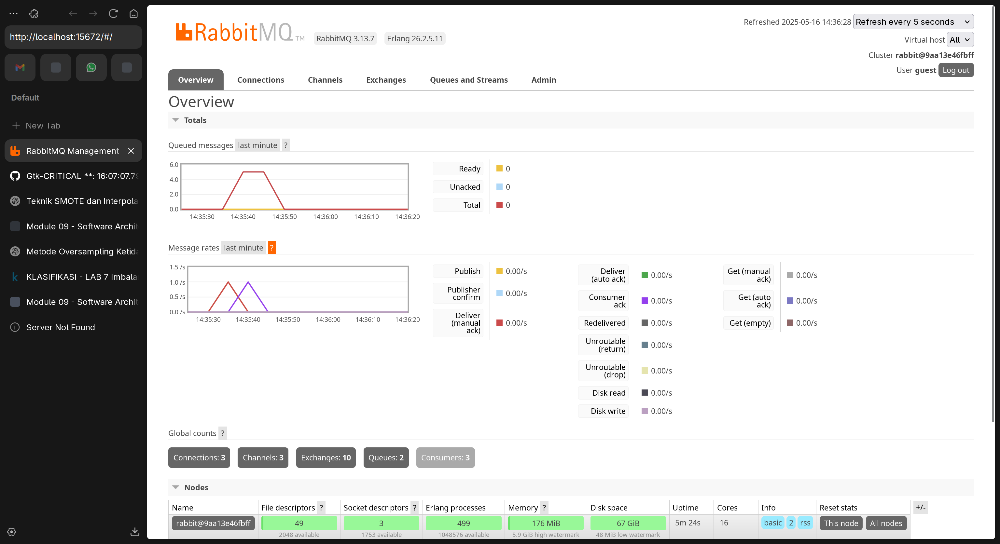

# Module 10 - Software Architecture

## Refleksi 10 - Subscriber

> What is **_amqp?_**

**AMQP** (Advanced Message Queuing Protocol) adalah protokol standar terbuka untuk pertukaran pesan antar aplikasi atau komponen sistem. Protokol ini dirancang untuk mendukung komunikasi message-oriented yang handal, dengan fitur seperti message queuing, routing, reliability, dan security. AMQP memungkinkan aplikasi mengirim pesan secara asynchronous dan memastikan pesan terkirim bahkan saat penerima tidak online, sehingga cocok untuk sistem terdistribusi.

> What it means? `guest:guest@localhost:5672`, what is the first **_guest_**, and what is
the second **_guest_**, and what is **_localhost:5672_** is for?

String `guest:guest@localhost:5672` adalah format URL koneksi untuk RabbitMQ. Format ini terdiri dari beberapa bagian: bagian pertama **_guest_** adalah username untuk autentikasi ke server RabbitMQ, bagian kedua **_guest_** adalah password untuk autentikasi, dan **_localhost:5672_** menunjukkan alamat server (localhost, yaitu komputer lokal) dan port (5672) dimana server RabbitMQ berjalan. Port 5672 adalah port default yang digunakan oleh protokol AMQP.

> In your subscriber directory, edit your Readme.md, add the screen capture of your RabbitMQ UI, and answer why the total number of queue is as such

Pada gambar di atas dapat diamati fenomena "slow subscriber" yang terlihat dari grafik RabbitMQ. Grafik "Queued messages" menunjukkan penumpukan pesan hingga sekitar 10 pesan pada puncaknya, sementara grafik "Message rates" memperlihatkan dua garis berbeda - garis merah yang lebih tinggi menunjukkan rate publisher yang mengirim pesan, dan garis ungu yang lebih rendah menunjukkan rate subscriber yang memproses pesan. Fenomena ini terjadi karena subscriber tidak dapat memproses pesan secepat publisher mengirimkannya, sehingga pesan menumpuk dalam queue sebelum diproses.

> Edit your subscriber README.md, put your capture about running three subscriber in the readme.md, and also add some
explanation/reflection of why it is like that. Take a look at the code of publisher and subscriber, do
you see something to improve?

Pada gambar di atas, terdapat 3 subscriber yang menerima pesan dari publisher. Ketiga subscriber ini berjalan secara paralel dan masing-masing mengambil pesan dari queue yang sama, yang memungkinkan distribusi beban kerja sehingga pesan dapat diproses lebih cepat dibandingkan dengan menggunakan satu subscriber saja.

Pada gambar di atas, dapat dilihat pada dashboard RabbitMQ bahwa terdapat 3 subscriber yang aktif (ditunjukkan dengan "Consumers: 3"). Grafik "Queued messages" menunjukkan puncak hanya sekitar 4-5 pesan, jauh lebih sedikit dibanding kasus single subscriber. Pada grafik "Message rates", garis merah (publisher) dan ungu (subscriber) terlihat lebih seimbang, menandakan dengan 3 subscriber sistem dapat memproses pesan hampir secepat pengirimannya. Hal ini membuktikan bahwa multiple subscriber meningkatkan throughput sistem secara signifikan.
